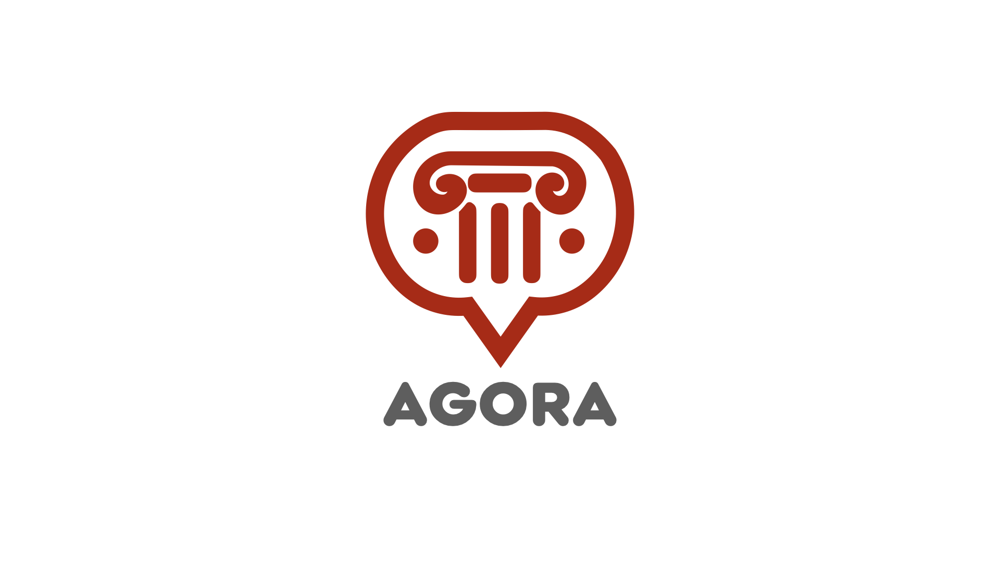

# AGORA : a Chat System 

  

## Description
This **Maven** project implements AGORA, a *chat system* that allows interaction between users. The project is designed to manage conversations with features such as managing *connexion*, *nicknames*, *contacts* and *messages*.

  

## Prerequisites
Before you begin, make sure you have the following installed on your machine:
- **JDK 17**
- **Maven**

## Installation
1. Clone this repository to your local machine:

`git clone https://github.com/Hilalh27/agora.git`

2. Navigate to the project directory:
   
`cd project `

3. Compile with Maven:

`mvn compile`

## Usage
To run the application, execute the main class via Maven:

`mvn exec:java -Dexec.mainClass="Main"`

## Execution example

Once the application is launched, follow these steps:

1. The main interface will appear, prompting you to enter your nickname.
2. Enter your desired nickname and click on Login.
3. After logging in:
   - Use the left sidebar to view your contacts. Click on a contact to open a chat window and send messages.
   - Access your profile by clicking on your profile icon in the top-right corner. Here, you can:
       - View your current nickname. 
       - View your IP address. 
       - Change your nickname.

## Tests
The project includes unit tests that can be run via Maven:

`mvn test`
