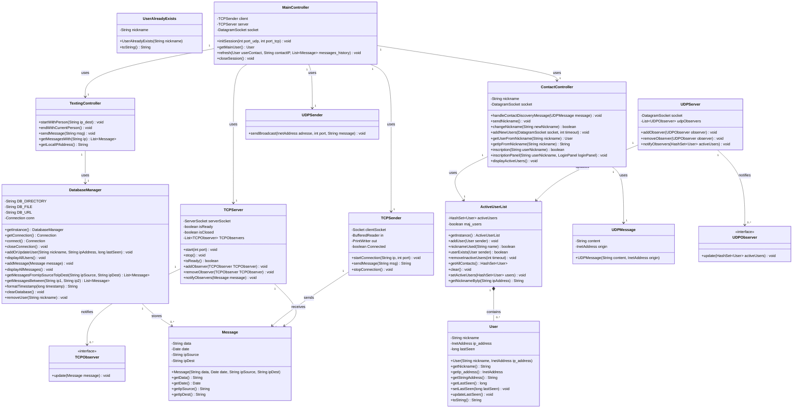

# Diagramme de classes

```mermaid
classDiagram
    class ActiveUserList {
        -HashSet~User~ activeUsers
        -boolean maj_users
        +getInstance() ActiveUserList
        +addUser(User sender) void
        +nicknameUsed(String name) boolean
        +userExists(User sender) boolean
        +removeInactiveUsers(int timeout) void
        +getAllContacts() HashSet~User~
        +clear() void
        +setActiveUsers(HashSet~User~ users) void
        +getNicknameByIp(String ipAddress) String
    }

    class User {
        -String nickname
        -InetAddress ip_address
        -long lastSeen
        +User(String nickname, InetAddress ip_address)
        +getNickname() String
        +getIp_address() InetAddress
        +getStringAddress() String
        +getLastSeen() long
        +setLastSeen(long lastSeen) void
        +updateLastSeen() void
        +toString() String
    }

    class UserAlreadyExists {
        -String nickname
        +UserAlreadyExists(String nickname)
        +toString() String
    }

    class ContactController {
        -String nickname
        -DatagramSocket socket
        +handleContactDiscoveryMessage(UDPMessage message) void
        +sendNickname() void
        +changeNickname(String newNickname) boolean
        +addNewUsers(DatagramSocket socket, int timeout) void
        +getUserFromNickname(String nickname) User
        +getIpFromNickname(String nickname) String
        +inscription(String userNickname) boolean
        +inscriptionPanel(String userNickname, LoginPanel loginPanel) void
        +displayActiveUsers() void
    }

    class MainController {
        -TCPSender client
        -TCPServer server
        -DatagramSocket socket
        +initSession(int port_udp, int port_tcp) void
        +getMainUser() User
        +refresh(User userContact, String contactIP, List~Message~ messages_history) void
        +closeSession() void
    }

    class TextingController {
        +startWithPerson(String ip_dest) void
        +endWithCurrentPerson() void
        +sendMessage(String msg) void
        +getMessagesWith(String ip) List~Message~
        +getLocalIPAddress() String
    }

    class DatabaseManager {
        -String DB_DIRECTORY
        -String DB_FILE
        -String DB_URL
        -Connection conn
        +getInstance() DatabaseManager
        +getConnection() Connection
        +connect() Connection
        +closeConnection() void
        +addOrUpdateUser(String nickname, String ipAddress, long lastSeen) void
        +displayAllUsers() void
        +addMessage(Message message) void
        +displayAllMessages() void
        +getMessagesFromIpSourceToIpDest(String ipSource, String ipDest) List~Message~
        +getMessagesBetween(String ip1, String ip2) List~Message~
        +formatTimestamp(long timestamp) String
        +clearDatabase() void
        +removeUser(String nickname) void
    }

    class Message {
        -String data
        -Date date
        -String ipSource
        -String ipDest
        +Message(String data, Date date, String ipSource, String ipDest)
        +getData() String
        +getDate() Date
        +getIpSource() String
        +getIpDest() String
    }

    class TCPSender {
        -Socket clientSocket
        -BufferedReader in
        -PrintWriter out
        -boolean Connected
        +startConnection(String ip, int port) void
        +sendMessage(String msg) String
        +stopConnection() void
    }

    class TCPServer {
        -ServerSocket serverSocket
        -boolean isReady
        -boolean isClosed
        -List~TCPObserver~ TCPObservers
        +start(int port) void
        +stop() void
        +isReady() boolean
        +addObserver(TCPObserver TCPObserver) void
        +removeObserver(TCPObserver TCPObserver) void
        +notifyObservers(Message message) void
    }

    class UDPSender {
        +sendBroadcast(InetAddress adresse, int port, String message) void
    }

    class UDPServer {
        -DatagramSocket socket
        -List~UDPObserver~ udpObservers
        +addObserver(UDPObserver observer) void
        +removeObserver(UDPObserver observer) void
        +notifyObservers(HashSet~User~ activeUsers) void
    }

    class UDPMessage {
        -String content
        -InetAddress origin
        +UDPMessage(String content, InetAddress origin)
    }

    class TCPObserver {
        <<interface>>
        +update(Message message) void
    }

    class UDPObserver {
        <<interface>>
        +update(HashSet~User~ activeUsers) void
    }

    %% Relations entre les classes
    ActiveUserList "1" *-- "0..*" User : contains
    ContactController "1" --> "1" ActiveUserList : uses
    ContactController "1" --> "1" UDPMessage : uses
    MainController "1" --> "1" ContactController : uses
    MainController "1" --> "1" TextingController : uses
    MainController "1" --> "1" TCPSender : uses
    MainController "1" --> "1" TCPServer : uses
    MainController "1" --> "1" UDPSender : uses
    TextingController "1" --> "1" DatabaseManager : uses
    DatabaseManager "1" --> "0..*" Message : stores
    TCPServer "1" --> "0..*" TCPObserver : notifies
    UDPServer "1" --> "0..*" UDPObserver : notifies
    TCPSender "1" --> "1" Message : sends
    TCPServer "1" --> "1" Message : receives
    UDPServer "1" --> "1" ActiveUserList : updates
```
