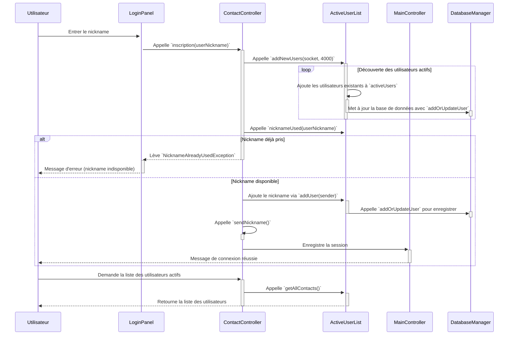
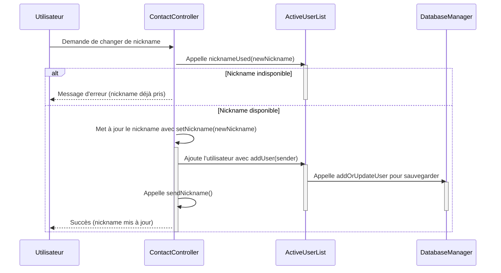
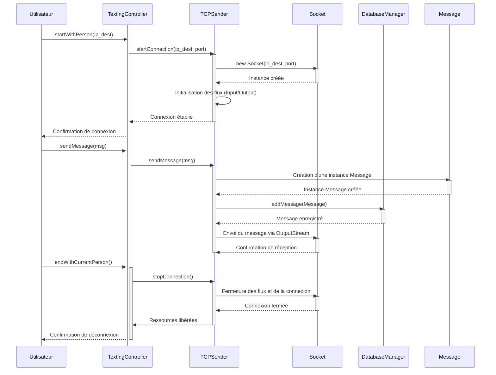
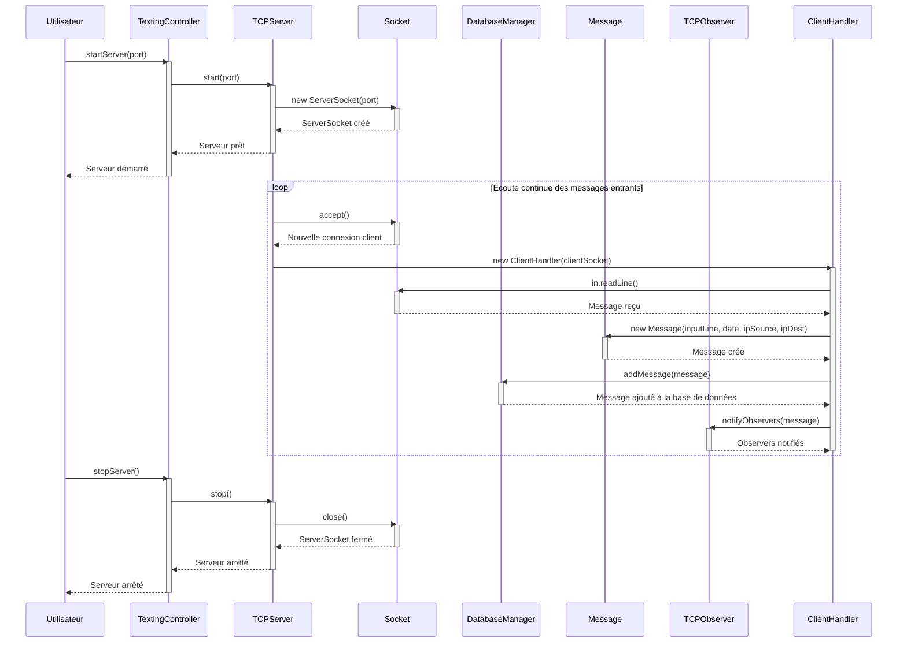

# Diagramme de séquence 1 : Inscription et découverte des utilisateurs actifs

# Diagramme de séquence 2 : Changement de nickname

# Diagramme de séquence 3 : Client TCP - Connexion et envoi de message

# Diagramme de séquence 4 : Serveur TCP - Connexions entrantes et réception de messages

